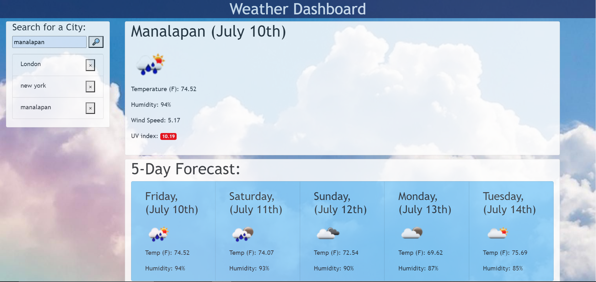

# weather-dashboard
This application allows the user to view weather information from any city in the world. it uses the OpenWeatherMap weather API
The app features a search bar that adds cities to a list. the user can choose to delete specific items from the list or view weather data of previously searched locations by clicking on the name of the city in the list.
the app also features a 5-day forecast section
The UV index box changes colors depending on how high the index is for that day. 

# Screenshot of Working Application
</img>